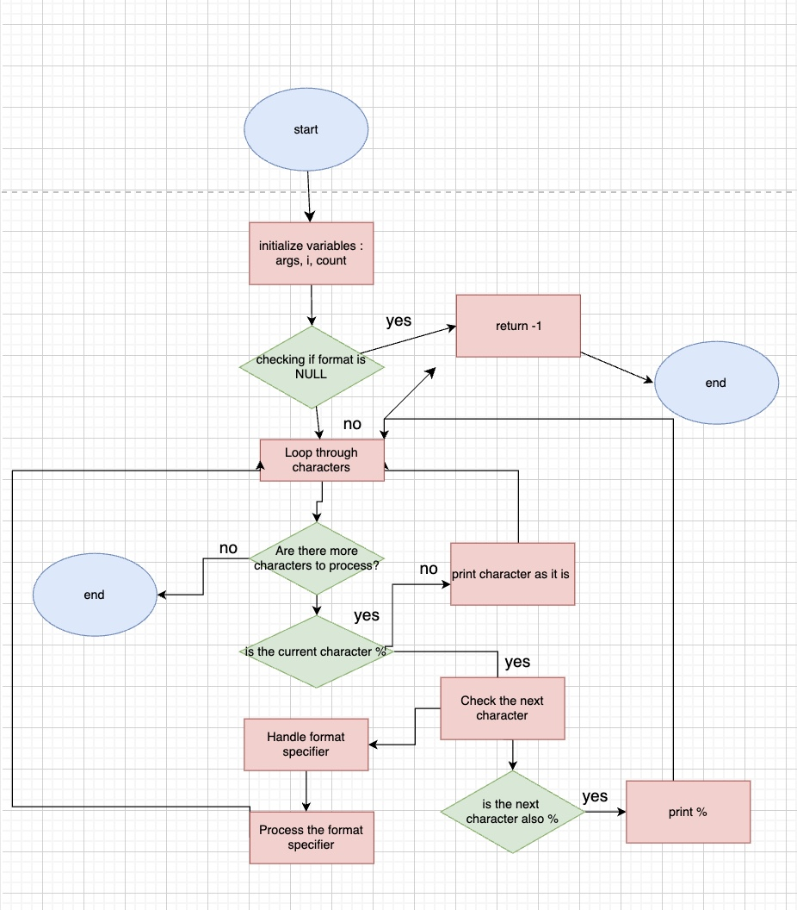

# _printf Project

## Introduction

This project is an implementation of the C standard library function `printf`. The `_printf` function produces output according to a format, handling various format specifiers similar to the standard `printf` function.

## Usage

```c
#include "main.h"

int main(void)
{
    _printf("Hello, World!\n");
    return (0);
}
```

## Features

- Handles the following format specifiers:
  - `%c` : Prints a single character
  - `%s` : Prints a string
  - `%d` / `%i` : Prints integers
  - `%%` : Prints a percent symbol
>≥
## Steps Taken in the Implementation

1. **Define the Function Signature:** We created the `_printf` function with the standard signature:
   
   ```c
   int _printf(const char *format, ...);
   ```
   
2. **Setting Up Variadic Functions:** To handle an arbitrary number of arguments, we used `va_list`, `va_start`, `va_arg`, and `va_end` macros. These allowed us to loop through the arguments passed after the format string.

3. **Handling Each Format Specifier:** For each format specifier, we wrote separate helper functions:
   - `print_char` for `%c`
   - `print_string` for `%s`
   - `print_int` for `%d` and `%i`
   - `print_percent` for `%%`
   
4. **Formatting and Output:** For integer types, we used functions like `itoa` (integer-to-string conversion).

5. **Handling Edge Cases and Errors:**
   - Printing `NULL` for strings.
   - Handling negative numbers.
   - Printing pointer addresses correctly in hexadecimal format.
   - If `_printf` encounters an unsupported specifier, it returns an error message.

## Flowchart

Below is a flowchart that outlines how `_printf` processes format specifiers:




## Man Page


## Explanation of Other Files

### main.h
This header file contains function prototypes and necessary library inclusions required for `_printf` to function.

### Integer to String Conversion (itoa)
We implemented a helper function to convert integers to strings for proper formatting in `_printf`.

## Example of `_printf` in Action

Here's an example of using the `_printf` function in a program:

```c
#include "main.h"

int main(void)
{
    _printf("Hello, World!\n");
    _printf("The value of pi is approximately: %5.5f\n", 3.14159);
    _printf("Integer: %d, String: %s, Character: %c\n", 42, "example", 'A');
    return (0);
}
```

Example output:

```
Hello, World!
The value of pi is approximately: 3.14159
Integer: 42, String: example, Character: A
```

## Compilation

To compile the `_printf` function, use:

```sh
gcc -Wall -Wextra -Werror -pedantic -std=gnu89 *.c -o printf
```

## Authors

- **Omar Rouigui**
- **Nina Galasso**

